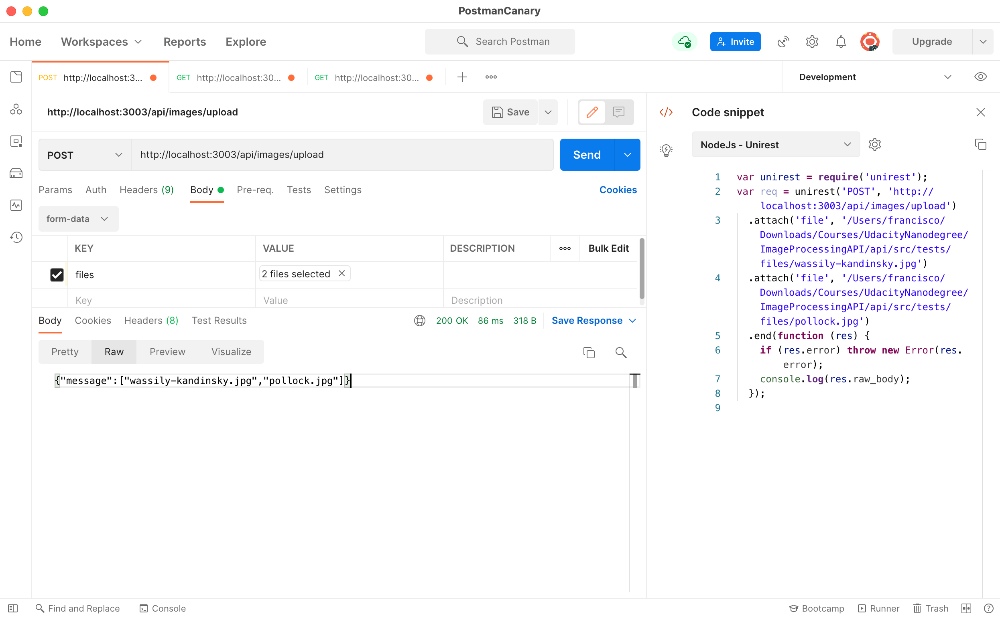

# Project Specification

### Comments

- The backend is inside the `api` folder.

- **The scripts available are:**
  
  - `npm run test` it will transpile and then execute jasmine.
  - `npm run perfect` it will execute prettier and lint.
  - `npm run compile` it will transpile the code using `tsc`.
  - `npm run build` it will clean the `dist/` folder, execute the `perfect`, `compile` and `compile` scripts.
  - `npm run start` it will start `nodemon`  on `src/index.ts`
  - You can also execute `node dist/` to run the app.
  
- **Endpoints:**
  
  - http://localhost:3003/ = Will show a message stating the server is up and running.
  
  - http://localhost:3003/api/images = Accepts the following query parameters:
  
    - <filename> : Name of the file without extension that has to be placed in the `full` directory or uploaded through the `upload` endpoint. (Required)
  
    - <witdh>: It is a number that specifies the width of the thumbnail file to be generated. (Optional. Default 200.)
  
    - <height>: It is a number that specifies the height of the thumbnail file to be generated. (Optional. Default 200.)
  
    - This endpoint will return a message stating that a field is missing and it is required.
  
    - Sample requests:
  
      ```http://localhost:3003/api/images?filename=pollock&width=500&height=300```
  
      ```http://localhost:3003/api/images?filename=fjord&width=500```
  
      ```http://localhost:3003/api/images?filename=mountfuji&height=300```
  
      ```http://localhost:3003/api/images?filename=santamonica```
  
  - http://localhost:3003/api/images/upload = Will allow you to upload one or more files. It will show messages when:
  
    - There are no files to upload.
    - Files types are not supported. Only `jpg`, `png` and `jpeg` are supported.
    - Uploading is currently limited to 10 files at the time.
  
  - http://localhost:3003/api/images/list = Will return a JSON object that contains information about the files in the `thumb` directory.
  
- It is possible to create thumbs of the same images on different sizes.

- I had to do a lot of research to write the tests for the uploading endpoint, it is different when uploading 1 file and more than 1.

- There is a logger that shows a message on the console every time an endpoint is visited.

- I have included a `copyAssets.ts ` script that copies all the images and needed files for the tests. 

### Note to reviewer:

- There is one test I would have loved to include. Testing multiple files upload, however I didn't manage to write the test for that one, I managed to do it for a single valid file, for an invalid file image and for an invalid file. Would you please guide me on this one?

  I wrote what I thought would be a correct test however it fails and I am not entirely sure why it is not working

  ```typescript
  it('Upload a list of valid image files', async () => {
      const requestPOST = request.post('/api/images/upload');
      for (const file of validListFilePath) {
        requestPOST.attach('files', file);
      }
      const response = await requestPOST;
      expect(response.status).toBe(200);
      expect(response.text).toEqual(
        JSON.stringify({
          message: ['pollock.jpg', 'wassily-kandinsky.jpg']
        })
      );
    });
  ```

  In fact if I test that endpoint it returns what I expect. Please, notice the order of the items in the array. I also tried with `.toContain()` checking there is a `message` in the response however the result of the test is `Error: Aborted`.

  

## Image Processing API

### Setup and Architecture

#### Set up a project structure that promotes scalability

- [x] Source code is kept separate from compiled code.
- [x] All tests should be contained in their own folder.
- [x] Separate modules are created for any processing.

#### Set up an npm project

- [x] Package.json should contain both devDependencies, and dependencies.
- [x] Scripts should be created for testing, linting/prettier, starting the server, and compiling TS.
- [x] Build script should run without error. 


### Functionality

#### Add and use Express to a node.js project

- [x] Start script should run without error.
- [x] Provided endpoint should open in the browser with status 200.

#### Follow middleware documentation to use middleware to create an API

- [x] Accessing the provided URL with image information should successfully resize an image and save it to disk on first access, then pull from disk on subsequent access attempts.
- [x] An error message should be provided to the user when an image has failed to process or does not exist.


### Code Quality

#### Write relevant unit tests with Jasmine and SuperTest to improve code quality and refactoring

- [x] Test script runs and all tests created pass. 
- [x] There is at least 1 test per endpoint and at least one test for image processing. 

#### Utilize TypeScript to avoid errors and improve maintainability

- [x] All code in the SRC folder should use the .ts filetype.
- [x] Functions should include typed parameters and return types and not use the `any` type.
- [x] Import and Export used for modules.
- [x] Build script should successfully compile TS to JS.

#### Write well-formatted linted code

- [x] Prettier and Lint scripts should run without producing any error messages.
- [x] An error message should be provided to the user when an image has failed to process or does not exist.


## Suggestions to Make Your Project Stand Out!

- [ ] Add additional processing to accept and output other image formats than JPG.
- [x] Modify the thumbnail filename to include the image size to allow for multiple sizes of the same image.
- [ ] Further explore the options in the Sharp module and add additional processing options.
- [x] Add in logging to record when images are processed or accessed.
- [ ] Create a front-end for uploading more images to the full-size directory.
- [ ] Create a front-end that displays a thumbnail directory.
- [ ] Create a front-end that allows for the selection of how to process a selected image.